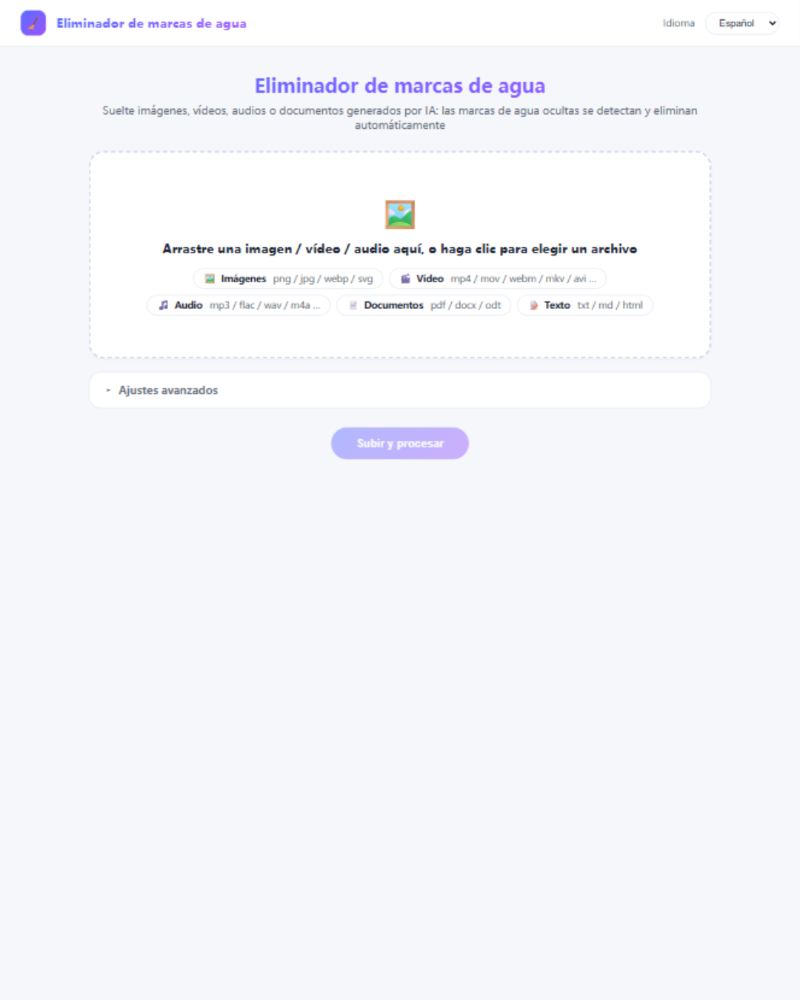

# antiaimark (Go)

[English](README.md) | [简体中文](README.zh-CN.md) | **Español** | [Français](README.fr.md) | [Русский](README.ru.md)

Detecta y elimina marcas de procedencia de IA en textos, imágenes, documentos,
vídeos y audios — esteganografía Unicode invisible, metadatos de imagen C2PA/EXIF/XMP,
metadatos de contenedores (PDF, DOCX, ODT, SVG, HTML, Markdown, vídeo y audio
best-effort) — con CLIs, un servicio HTTP + interfaz web, un servidor MCP para
IDEs con IA y limpieza automática en segundo plano. Go puro, binarios
estáticos, sin dependencias en tiempo de ejecución.

## Funciones



- **Texto (Capa A)** — caracteres de ancho cero, controles bidi, caracteres de
  etiqueta, espacios homoglifos, planos de uso privado; round-trip byte-exacto de entrada no UTF-8
- **Imágenes** — metadatos PNG/JPEG/WebP: manifiestos C2PA/JUMBF, XMP
  `digitalSourceType=trainedAlgorithmicMedia`, bloques de texto del generador; píxeles intactos
- **Contenedores** — PDF (exiftool + qpdf si están disponibles), interior de
  DOCX/ODT, bloques de metadatos SVG, meta/JSON-LD de HTML, frontmatter Markdown
- **Vídeo y audio** — best-effort: escaneo de cajas C2PA uuid/JUMBF, átomo QuickTime
  `©too`, escaneo de marcadores (Suno/ElevenLabs/MusicGen…), borrado con `exiftool -all=`
- **Palabras clave de proveedores** — OpenAI/Imagen/Firefly/Midjourney/Stable
  Diffusion/FLUX/Ideogram/Recraft/Grok + 豆包·即梦/腾讯混元/通义万相/可灵/智谱/文心一格/海螺…
  (las etiquetas CMS tipo WordPress se conservan)
- **HTTP + interfaz web** — API JSON (`/inspect` `/clean`), subida por
  arrastrar y soltar con descarga de un solo uso para imágenes y vídeos
- **Servidor MCP** — herramientas nativas en Claude Code/Desktop, Cursor, Windsurf, Cline, Continue, Zed…
- **5 idiomas** — en/zh/es/fr/ru en CLIs, errores HTTP, interfaz web y descripciones MCP
- **Limpieza automática** — umbral de espacio en disco, periodo configurable

## Inicio rápido

```bash
go build ./...          # compilar todo
go test ./...           # ejecutar la suite
./deploy.sh build       # o: los 12 binarios en bin/
./bin/antiaimark-server # HTTP + web en 127.0.0.1:8765
```

Abra http://127.0.0.1:8765/ y arrastre una imagen o un vídeo. Ejemplos de CLI:

```bash
./bin/inspect-file foto.png --json      # inspección unificada (enrutado automático)
./bin/clean-file   doc.docx             # escribe doc.cleaned.docx
./bin/clean-text   notas.txt --lang es  # mensajes localizados
./bin/audit-dir    ~/blog               # auditoría agregada de directorio
```

## Despliegue

`./deploy.sh` cubre todos los caminos (también con `make package`, `make install-systemd`):

| Comando | Qué hace |
| --- | --- |
| `./deploy.sh build` | compila todos los binarios de la plataforma anfitriona en `bin/` |
| `./deploy.sh build-linux [amd64\|arm64\|386]` | compila cruzado binarios linux estáticos |
| `./deploy.sh package [arch]` | tarball autocontenido en `dist/` (binarios + README + deploy/) |
| `./deploy.sh docker-build [tag]` | construye la imagen Docker distroless |
| `./deploy.sh docker-run` | ejecuta la imagen con valores de producción (loopback, solo lectura, tmpfs) |
| `sudo ./deploy.sh install-systemd` | Linux bare-metal: binarios + usuario dedicado + archivo env + unidad systemd endurecida |
| `sudo ./deploy.sh uninstall-systemd` | detiene y elimina la unidad |

Flujo bare-metal en un servidor linux:

```bash
./deploy.sh package amd64                  # en su estación de trabajo
scp dist/antiaimark-*-linux-amd64.tar.gz server:
ssh server 'tar xzf antiaimark-*.tar.gz && cd antiaimark && sudo ./deploy.sh install-systemd'
# configurar: sudoedit /etc/antiaimark.env   (puerto, clave API, auto-limpieza…)
sudo systemctl restart antiaimark
```

Alternativa Docker: `docker compose up -d` (bind loopback, healthcheck,
rootfs de solo lectura, capacidades reducidas; ajustes por entorno).

### Configuración (archivo env / entorno)

| Variable | Por defecto | Significado |
| --- | --- | --- |
| `ANTIAIMARK_SERVER_HOST` | `127.0.0.1` | dirección de enlace (solo loopback salvo proxy inverso) |
| `ANTIAIMARK_SERVER_PORT` | `8765` | puerto |
| `ANTIAIMARK_SERVER_API_KEY` | vacío | exige `Authorization: Bearer <clave>` si se define |
| `ANTIAIMARK_LANG` | idioma del sistema | `en` `zh` `es` `fr` `ru` |
| `ANTIAIMARK_AUTO_CLEAN` | `0` | `1` activa el conserje en segundo plano |
| `ANTIAIMARK_AUTO_CLEAN_INTERVAL` | `15m` | periodo de comprobación |
| `ANTIAIMARK_AUTO_CLEAN_THRESHOLD` | `11` | % libre que dispara la limpieza |
| `ANTIAIMARK_AUTO_CLEAN_TTL` | `24h` | retención de descargas antes de expulsarlas |

El conserje solo borra los directorios temporales `wm-*` del propio servicio y
las descargas caducadas — nada más en el disco; los directorios con menos de 1
hora están protegidos para no interrumpir peticiones en curso.

## API HTTP

| Método | Ruta | Propósito |
| --- | --- | --- |
| GET | `/health` `/capabilities` `/openapi.json` | vida, herramientas disponibles, OpenAPI 3.0.3 |
| POST | `/inspect` / `/clean` | archivo base64 de entrada, hallazgos/bytes limpios de salida |
| GET | `/` | interfaz web (arrastrar y soltar, 5 idiomas) |
| POST | `/api/upload` → GET `/api/download/{token}` | subida multipart, descarga limpia de un solo uso |
| GET | `/api/i18n?lang=es` | catálogo de mensajes de la interfaz |

## Integración con IDEs de IA (MCP)

```bash
claude mcp add antiaimark -- /ruta/abs/a/bin/antiaimark-mcp
# mcp.json de Cursor / Windsurf / Cline:
{ "mcpServers": { "antiaimark": { "command": "/ruta/abs/a/antiaimark-mcp" } } }
```

Herramientas: `capabilities`, `inspect_file`, `clean_file`, `inspect_text`,
`clean_text` — las descripciones se localizan al idioma del IDE.

## Harness ML opcionales

La eliminación a nivel de píxel (CtrlRegen / MarkDiffusion), la puntuación
SynthID y la detección MarkLLM funcionan como adaptadores externos cuando
`NOAI_WATERMARK_DIR`, `MARKDIFFUSION_DIR`, `REVERSE_SYNTHID_DIR` o `MARKLLM_DIR`
apuntan a checkouts; sin ellos el núcleo funciona de forma autónoma y
`/capabilities` los informa como ausentes.

## Arquitectura

Biblioteca núcleo más fachadas delgadas (CLIs / HTTP / MCP) — vea
[README-ARCHITECTURE.md](README-ARCHITECTURE.md) (inglés) para la estratificación y la guía de extensión.

## Licencia

MIT — vea [LICENSE](LICENSE).
