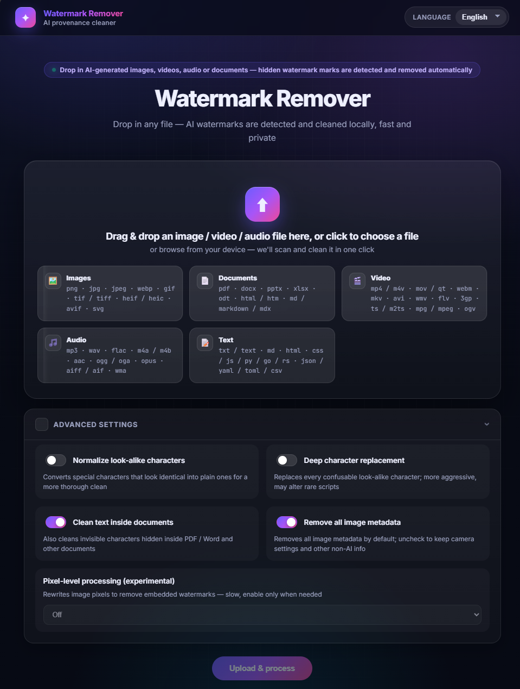

# antiaimark (Go)

**English** | [简体中文](README.zh-CN.md) | [Español](README.es.md) | [Français](README.fr.md) | [Русский](README.ru.md)

Detect and strip AI provenance marks from text, images, documents, videos and audio —
invisible Unicode steganography, C2PA/EXIF/XMP image metadata, container
metadata (PDF, DOCX, ODT, SVG, HTML, Markdown, best-effort video) — with
CLIs, an HTTP service + web UI, an MCP server for AI IDEs, and background
auto-clean. Pure Go, static binaries, no runtime dependencies.

## Features

- **Text (Layer A)** — zero-width characters, bidi overrides, tag characters,
  homoglyph spaces, private-use planes; byte-exact round-trip of non-UTF-8 input
- **Images** — PNG/JPEG/WebP metadata: C2PA/JUMBF manifests, XMP
  `digitalSourceType=trainedAlgorithmicMedia`, generator text chunks; pixel data untouched
- **Containers** — PDF (exiftool + qpdf when available), DOCX/ODT internals,
  SVG metadata blocks, HTML meta/JSON-LD, Markdown frontmatter
- **Video & audio** — best-effort: C2PA uuid/JUMBF box scan, QuickTime `©too` atom,
  marker scan (Suno/ElevenLabs/MusicGen…), `exiftool -all=` strip
- **Vendor keywords** — OpenAI/Imagen/Firefly/Midjourney/Stable Diffusion/
  FLUX/Ideogram/Recraft/Grok + 豆包·即梦/腾讯混元/通义万相/可灵/智谱/文心一格/海螺…
  (CMS tags like WordPress are preserved)
- **HTTP + web UI** — JSON API (`/inspect` `/clean`), drag & drop upload with
  one-shot download for images and videos



- **MCP server** — native tools inside Claude Code/Desktop, Cursor, Windsurf, Cline, Continue, Zed…
- **5 languages** — en / zh / es / fr / ru across CLIs, HTTP errors, web UI and MCP descriptions
- **Background auto-clean** — disk-space threshold, configurable period

## Quickstart

```bash
go build ./...          # build everything
go test ./...           # run the suite
./deploy.sh build       # or: build all 12 binaries into bin/
./bin/antiaimark-server # HTTP + web UI on 127.0.0.1:8765
```

Open http://127.0.0.1:8765/ and drag an image or video in. CLI examples:

```bash
./bin/inspect-file photo.png --json      # unified inspect (auto-routes)
./bin/clean-file   doc.docx              # writes doc.cleaned.docx
./bin/clean-text   notes.txt --lang zh   # localized CLI messages
./bin/audit-dir    ~/blog                # aggregate directory audit
```

## Deployment

`./deploy.sh` covers every path (also via `make package`, `make install-systemd`):

| Command | What it does |
| --- | --- |
| `./deploy.sh build` | build all binaries for the host platform into `bin/` |
| `./deploy.sh build-linux [amd64\|arm64\|386]` | cross-compile static linux binaries |
| `./deploy.sh package [arch]` | self-contained tarball in `dist/` (binaries + README + deploy/) |
| `./deploy.sh docker-build [tag]` | build the distroless Docker image |
| `./deploy.sh docker-run` | run the image with production defaults (loopback, read-only, tmpfs) |
| `sudo ./deploy.sh install-systemd` | Linux bare-metal: binaries + dedicated user + env file + hardened systemd unit |
| `sudo ./deploy.sh uninstall-systemd` | stop and remove the unit |

Bare-metal flow on a linux server:

```bash
./deploy.sh package amd64                  # on your workstation
scp dist/antiaimark-*-linux-amd64.tar.gz server:
ssh server 'tar xzf antiaimark-*.tar.gz && cd antiaimark && sudo ./deploy.sh install-systemd'
# configure: sudoedit /etc/antiaimark.env   (port, API key, auto-clean…)
sudo systemctl restart antiaimark
```

Docker alternative: `docker compose up -d` (loopback bind, healthcheck,
read-only rootfs, dropped capabilities; knobs via environment).

### Configuration (env file / environment)

| Variable | Default | Meaning |
| --- | --- | --- |
| `ANTIAIMARK_SERVER_HOST` | `127.0.0.1` | bind address (loopback-only unless behind a proxy) |
| `ANTIAIMARK_SERVER_PORT` | `8765` | port |
| `ANTIAIMARK_SERVER_API_KEY` | empty | require `Authorization: Bearer <key>` when set |
| `ANTIAIMARK_LANG` | system locale | `en` `zh` `es` `fr` `ru` |
| `ANTIAIMARK_AUTO_CLEAN` | `0` | `1` enables the background janitor |
| `ANTIAIMARK_AUTO_CLEAN_INTERVAL` | `15m` | check period |
| `ANTIAIMARK_AUTO_CLEAN_THRESHOLD` | `11` | free-space % that triggers cleanup |
| `ANTIAIMARK_AUTO_CLEAN_TTL` | `24h` | download retention before eviction |

The janitor only ever deletes this service's own `wm-*` temp directories and
expired downloads — nothing else on disk; directories younger than 1h are
protected so in-flight requests are never disturbed.

## HTTP API

| Method | Path | Purpose |
| --- | --- | --- |
| GET | `/health` `/capabilities` `/openapi.json` | liveness, tool availability, OpenAPI 3.0.3 |
| POST | `/inspect` / `/clean` | base64 file in, findings/cleaned bytes out |
| GET | `/` | web UI (drag & drop, 5 languages) |
| POST | `/api/upload` → GET `/api/download/{token}` | multipart upload, one-shot cleaned download |
| GET | `/api/i18n?lang=zh` | message catalog for the UI |

## AI IDE integration (MCP)

```bash
claude mcp add antiaimark -- /abs/path/to/bin/antiaimark-mcp
# Cursor / Windsurf / Cline mcp.json:
{ "mcpServers": { "antiaimark": { "command": "/abs/path/to/antiaimark-mcp" } } }
```

Two transports are supported:

- **stdio** — `bin/antiaimark-mcp`, the `command` form above (Claude Code,
  Cursor, Windsurf, Cline, Continue, Zed, …).
- **Streamable HTTP** — register the running HTTP service (`antiaimark-server`)
  as a remote MCP server, no binary path needed:

```json
{ "mcpServers": { "antiaimark": { "type": "http", "url": "http://127.0.0.1:8765/mcp" } } }
```

Tools: `capabilities`, `inspect_file`, `clean_file`, `inspect_text`,
`clean_text` — descriptions localize to the IDE language.

Step-by-step registration for every IDE (Claude Code/Desktop, Cursor,
Windsurf, Cline, Continue, Zed, VS Code Copilot, JetBrains, Trae, Codex,
Gemini, Amazon Q): see [docs/MCP.md](docs/MCP.md). Prebuilt binaries for all
platforms are published to GitHub Releases and installed with the one-liners
below:

```bash
# macOS / Linux
curl -fsSL https://raw.githubusercontent.com/n0bele/AntiAIMark/main/scripts/install.sh | bash
# Windows (PowerShell)
irm https://raw.githubusercontent.com/n0bele/AntiAIMark/main/scripts/install.ps1 | iex
```

### Claude Code plugin marketplace

Installable as a Claude Code plugin (one command, auto-updates):

```bash
claude plugin marketplace add n0bele/AntiAIMark
claude plugin install antiaimark@antiaimark
```

Or in the `/plugin` UI: Marketplaces → add `n0bele/AntiAIMark`, then install `antiaimark`.
See [plugins/antiaimark/README.md](plugins/antiaimark/README.md) for details. To get listed
in the Claude Code Discover tab / community marketplace, follow
[docs/plugin-submission.md](docs/plugin-submission.md).

## Optional ML harnesses

Pixel removal (CtrlRegen / MarkDiffusion), SynthID scoring and MarkLLM text
detection run as external adapters when `NOAI_WATERMARK_DIR`,
`MARKDIFFUSION_DIR`, `REVERSE_SYNTHID_DIR` or `MARKLLM_DIR` point at
checkouts; without them the core works standalone and `/capabilities`
reports them as absent.

## Architecture

Core library plus thin facades (CLIs / HTTP / MCP) — see
[README-ARCHITECTURE.md](README-ARCHITECTURE.md) for the layering and the
plugin-extension guide.

## License

MIT — see [LICENSE](LICENSE).
