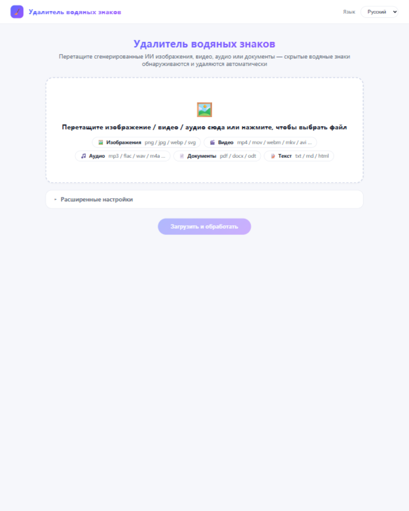

# antiaimark

[English](README.md) | [简体中文](README.zh-CN.md) | [Español](README.es.md) | [Français](README.fr.md) | **Русский**

Обнаруживает и удаляет метки происхождения ИИ в текстах, изображениях,
документах и видео — невидимая стеганография Unicode, метаданные изображений
C2PA/EXIF/XMP, метаданные контейнеров (PDF, DOCX, ODT, SVG, HTML, Markdown,
видео и аудио best-effort) — с CLI, HTTP-сервисом + веб-интерфейсом, MCP-сервером для
ИИ-IDE и фоновой автоочисткой. Чистый Go, статические бинарники, никаких
зависимостей времени выполнения.

## Возможности



- **Текст (Слой A)** — символы нулевой ширины, bidi-управление, теговые
  символы, омоглифные пробелы, приватные планы; побайтово точный round-trip не-UTF-8 ввода
- **Изображения** — метаданные PNG/JPEG/WebP: манифесты C2PA/JUMBF, XMP
  `digitalSourceType=trainedAlgorithmicMedia`, текстовые блоки генератора; пиксели не трогаются
- **Контейнеры** — PDF (exiftool + qpdf при наличии), внутренности
  DOCX/ODT, блоки метаданных SVG, meta/JSON-LD HTML, frontmatter Markdown
- **Видео и аудио** — best-effort: скан C2PA uuid/JUMBF-боксов, атом QuickTime
  `©too`, скан маркеров (Suno/ElevenLabs/MusicGen…), очистка `exiftool -all=`
- **Ключевые слова вендоров** — OpenAI/Imagen/Firefly/Midjourney/Stable
  Diffusion/FLUX/Ideogram/Recraft/Grok + 豆包·即梦/腾讯混元/通义万相/可灵/智谱/文心一格/海螺…
  (CMS-теги вроде WordPress сохраняются)
- **HTTP + веб-интерфейс** — JSON API (`/inspect` `/clean`), загрузка
  перетаскиванием с одноразовым скачиванием для изображений и видео
- **MCP-сервер** — нативные инструменты в Claude Code/Desktop, Cursor, Windsurf, Cline, Continue, Zed…
- **5 языков** — en/zh/es/fr/ru для CLI, ошибок HTTP, веб-интерфейса и описаний MCP
- **Фоновая автоочистка** — порог свободного места, настраиваемый период

## Быстрый старт

```bash
go build ./...          # собрать всё
go test ./...           # запустить тесты
./deploy.sh build       # или: все 12 бинарников в bin/
./bin/antiaimark-server # HTTP + веб на 127.0.0.1:8765
```

Откройте http://127.0.0.1:8765/ и перетащите изображение или видео. Примеры CLI:

```bash
./bin/inspect-file фото.png --json      # унифицированная инспекция (авто-маршрутизация)
./bin/clean-file   doc.docx             # пишет doc.cleaned.docx
./bin/clean-text   заметки.txt --lang ru
./bin/audit-dir    ~/blog               # агрегированный аудит каталога
```

## Развёртывание

`./deploy.sh` покрывает все пути (также через `make package`, `make install-systemd`):

| Команда | Что делает |
| --- | --- |
| `./deploy.sh build` | собирает все бинарники платформы в `bin/` |
| `./deploy.sh build-linux [amd64\|arm64\|386]` | кросс-компиляция статических linux-бинарников |
| `./deploy.sh package [arch]` | самодостаточный tarball в `dist/` (бинарники + README + deploy/) |
| `./deploy.sh docker-build [tag]` | собирает distroless Docker-образ |
| `./deploy.sh docker-run` | запускает образ с продакшен-умолчаниями (loopback, read-only, tmpfs) |
| `sudo ./deploy.sh install-systemd` | Linux bare-metal: бинарники + выделенный пользователь + env-файл + усиленный systemd-юнит |
| `sudo ./deploy.sh uninstall-systemd` | останавливает и удаляет юнит |

Поток bare-metal на linux-сервере:

```bash
./deploy.sh package amd64                  # на рабочей станции
scp dist/antiaimark-*-linux-amd64.tar.gz server:
ssh server 'tar xzf antiaimark-*.tar.gz && cd antiaimark && sudo ./deploy.sh install-systemd'
# настройка: sudoedit /etc/antiaimark.env   (порт, API-ключ, автоочистка…)
sudo systemctl restart antiaimark
```

Альтернатива Docker: `docker compose up -d` (loopback-привязка, healthcheck,
read-only rootfs, снятые capabilities; параметры через окружение).

### Конфигурация (env-файл / окружение)

| Переменная | По умолчанию | Значение |
| --- | --- | --- |
| `ANTIAIMARK_SERVER_HOST` | `127.0.0.1` | адрес привязки (только loopback, иначе за reverse-proxy) |
| `ANTIAIMARK_SERVER_PORT` | `8765` | порт |
| `ANTIAIMARK_SERVER_API_KEY` | пусто | требует `Authorization: Bearer <ключ>` при установке |
| `ANTIAIMARK_LANG` | язык системы | `en` `zh` `es` `fr` `ru` |
| `ANTIAIMARK_AUTO_CLEAN` | `0` | `1` включает фоновый уборщик |
| `ANTIAIMARK_AUTO_CLEAN_INTERVAL` | `15m` | период проверки |
| `ANTIAIMARK_AUTO_CLEAN_THRESHOLD` | `11` | % свободного места, запускающий очистку |
| `ANTIAIMARK_AUTO_CLEAN_TTL` | `24h` | срок хранения загрузок до выселения |

Уборщик удаляет только собственные временные каталоги `wm-*` сервиса и
просроченные загрузки — больше ничего на диске; каталоги моложе часа защищены,
чтобы не мешать текущим запросам.

## HTTP API

| Метод | Путь | Назначение |
| --- | --- | --- |
| GET | `/health` `/capabilities` `/openapi.json` | живость, доступность инструментов, OpenAPI 3.0.3 |
| POST | `/inspect` / `/clean` | base64-файл на входе, находки/очищенные байты на выходе |
| GET | `/` | веб-интерфейс (drag & drop, 5 языков) |
| POST | `/api/upload` → GET `/api/download/{token}` | multipart-загрузка, одноразовое скачивание результата |
| GET | `/api/i18n?lang=ru` | каталог сообщений интерфейса |

## Интеграция с ИИ-IDE (MCP)

```bash
claude mcp add antiaimark -- /абс/путь/к/bin/antiaimark-mcp
# mcp.json для Cursor / Windsurf / Cline:
{ "mcpServers": { "antiaimark": { "command": "/абс/путь/к/antiaimark-mcp" } } }
```

Инструменты: `capabilities`, `inspect_file`, `clean_file`, `inspect_text`,
`clean_text` — описания локализуются под язык IDE.

## Опциональные ML-харнесы

Попиксельное удаление (CtrlRegen / MarkDiffusion), скоринг SynthID и
обнаружение MarkLLM работают как внешние адаптеры, когда `NOAI_WATERMARK_DIR`,
`MARKDIFFUSION_DIR`, `REVERSE_SYNTHID_DIR` или `MARKLLM_DIR` указывают на
чек-ауты; без них ядро работает автономно, а `/capabilities` честно сообщает
об их отсутствии.

## Архитектура

Библиотека-ядро плюс тонкие фасады (CLI / HTTP / MCP) — см.
[README-ARCHITECTURE.md](README-ARCHITECTURE.md) (англ.) для описания слоёв и
руководства по расширению.

## Лицензия

MIT — см. [LICENSE](LICENSE).
