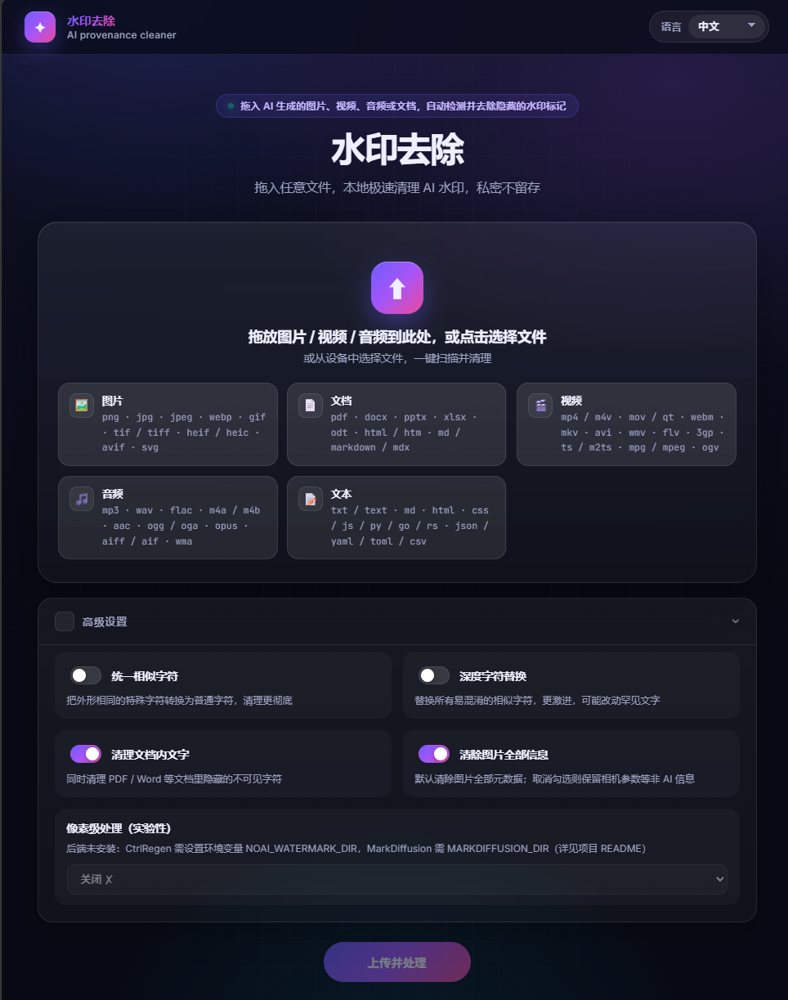

# antiaimark（Go 版）

[English](README.md) | **简体中文** | [Español](README.es.md) | [Français](README.fr.md) | [Русский](README.ru.md)

检测并清除文本、图片、文档与视频中的 AI 来源标记——不可见 Unicode 隐写、C2PA/EXIF/XMP
图片元数据、容器元数据（PDF、DOCX、ODT、SVG、HTML、Markdown、视频/音频 best-effort）——提供
CLI、HTTP 服务 + 网页界面、面向 AI IDE 的 MCP 服务器，以及后台自动清理。纯 Go、静态
编译、零运行时依赖。

## 功能

- **文本（Layer A）**——零宽字符、双向控制符、标签字符、同形空格、私用区；非 UTF-8 输入逐字节无损往返
- **图片**——PNG/JPEG/WebP 元数据：C2PA/JUMBF 清单、XMP `digitalSourceType=trainedAlgorithmicMedia`、生成器文本块；像素数据不动
- **容器**——PDF（有 exiftool + qpdf 时使用）、DOCX/ODT 内部结构、SVG 元数据块、HTML meta/JSON-LD、Markdown frontmatter
- **视频/音频**——best-effort：C2PA uuid/JUMBF box 扫描、QuickTime `©too` 原子、标记扫描（Suno/ElevenLabs/MusicGen…）、`exiftool -all=` 剥离
- **厂商关键字**——OpenAI/Imagen/Firefly/Midjourney/Stable Diffusion/FLUX/Ideogram/Recraft/Grok +
  豆包·即梦/腾讯混元/通义万相/可灵/智谱/文心一格/海螺……（WordPress 等 CMS 标签保留不删）
- **HTTP + 网页界面**——JSON API（`/inspect` `/clean`），图片视频拖拽上传、一次性下载



- **MCP 服务器**——在 Claude Code/Desktop、Cursor、Windsurf、Cline、Continue、Zed 中作为原生工具
- **五种语言**——en/zh/es/fr/ru 覆盖 CLI、HTTP 错误、网页界面与 MCP 描述
- **后台自动清理**——磁盘空间阈值触发，周期可配置

## 快速开始

```bash
go build ./...          # 构建全部
go test ./...           # 运行测试
./deploy.sh build       # 或者：把 12 个二进制构建到 bin/
./bin/antiaimark-server # HTTP + 网页界面，监听 127.0.0.1:8765
```

打开 http://127.0.0.1:8765/，拖入图片或视频即可。CLI 示例：

```bash
./bin/inspect-file photo.png --json      # 统一检测（自动路由格式）
./bin/clean-file   doc.docx              # 输出 doc.cleaned.docx
./bin/clean-text   notes.txt --lang zh   # 中文命令行提示
./bin/audit-dir    ~/blog                # 目录聚合审计
```

## 部署

`./deploy.sh` 覆盖全部路径（也可用 `make package`、`make install-systemd`）：

| 命令 | 作用 |
| --- | --- |
| `./deploy.sh build` | 为当前平台构建全部二进制到 `bin/` |
| `./deploy.sh build-linux [amd64\|arm64\|386]` | 交叉编译静态 linux 二进制 |
| `./deploy.sh package [arch]` | 在 `dist/` 生成自包含 tar 包（二进制 + README + deploy/） |
| `./deploy.sh docker-build [tag]` | 构建 distroless Docker 镜像 |
| `./deploy.sh docker-run` | 以生产默认参数运行镜像（环回端口、只读、tmpfs） |
| `sudo ./deploy.sh install-systemd` | Linux 裸机：二进制 + 专用用户 + env 文件 + 加固 systemd 单元 |
| `sudo ./deploy.sh uninstall-systemd` | 停止并移除服务单元 |

Linux 服务器裸机部署流程：

```bash
./deploy.sh package amd64                  # 在你的工作站上打包
scp dist/antiaimark-*-linux-amd64.tar.gz server:
ssh server 'tar xzf antiaimark-*.tar.gz && cd antiaimark && sudo ./deploy.sh install-systemd'
# 配置：sudoedit /etc/antiaimark.env   （端口、API key、自动清理…）
sudo systemctl restart antiaimark
```

Docker 备选：`docker compose up -d`（环回绑定、健康检查、只读根文件系统、降权；参数经环境变量传入）。

### 配置（env 文件 / 环境变量）

| 变量 | 默认 | 说明 |
| --- | --- | --- |
| `ANTIAIMARK_SERVER_HOST` | `127.0.0.1` | 绑定地址（除非有反代，保持环回） |
| `ANTIAIMARK_SERVER_PORT` | `8765` | 端口 |
| `ANTIAIMARK_SERVER_API_KEY` | 空 | 设置后要求 `Authorization: Bearer <key>` |
| `ANTIAIMARK_LANG` | 系统语言 | `en` `zh` `es` `fr` `ru` |
| `ANTIAIMARK_AUTO_CLEAN` | `0` | `1` 开启后台自动清理 |
| `ANTIAIMARK_AUTO_CLEAN_INTERVAL` | `15m` | 检查周期 |
| `ANTIAIMARK_AUTO_CLEAN_THRESHOLD` | `11` | 触发清理的空闲空间百分比 |
| `ANTIAIMARK_AUTO_CLEAN_TTL` | `24h` | 下载文件保留时长 |

自动清理只会删除本服务自己的 `wm-*` 临时目录与过期下载——不碰磁盘上其他任何文件；
1 小时内的目录受保护，绝不干扰进行中的请求。

## HTTP API

| 方法 | 路径 | 用途 |
| --- | --- | --- |
| GET | `/health` `/capabilities` `/openapi.json` | 存活、工具可用性、OpenAPI 3.0.3 |
| POST | `/inspect` / `/clean` | base64 文件进，检测结果/清洗字节出 |
| GET | `/` | 网页界面（拖拽上传，五种语言） |
| POST | `/api/upload` → GET `/api/download/{token}` | multipart 上传，一次性清洗结果下载 |
| GET | `/api/i18n?lang=zh` | 界面消息字典 |

## AI IDE 接入（MCP）

```bash
claude mcp add antiaimark -- /abs/path/to/bin/antiaimark-mcp
# Cursor / Windsurf / Cline 的 mcp.json：
{ "mcpServers": { "antiaimark": { "command": "/abs/path/to/antiaimark-mcp" } } }
```

支持两种传输方式：

- **stdio** —— `bin/antiaimark-mcp`，即上面的 `command` 形式（Claude Code、
  Cursor、Windsurf、Cline、Continue、Zed 等）。
- **Streamable HTTP** —— 把运行中的 HTTP 服务（`antiaimark-server`）注册为远程
  MCP 服务器，无需填写二进制路径：

```json
{ "mcpServers": { "antiaimark": { "type": "http", "url": "http://127.0.0.1:8765/mcp" } } }
```

工具：`capabilities`、`inspect_file`、`clean_file`、`inspect_text`、
`clean_text`——描述随 IDE 语言自动本地化。

各 IDE 的完整分步注册说明（Claude Code/Desktop、Cursor、Windsurf、Cline、
Continue、Zed、VS Code Copilot、JetBrains、Trae、Codex、Gemini、Amazon Q）：
见 [docs/MCP.md](docs/MCP.md)。各平台预编译产物发布在 GitHub Releases，
可用下面的命令一键安装：

```bash
# macOS / Linux
curl -fsSL https://raw.githubusercontent.com/n0bele/AntiAIMark/main/scripts/install.sh | bash
# Windows（PowerShell）
irm https://raw.githubusercontent.com/n0bele/AntiAIMark/main/scripts/install.ps1 | iex
```

## 可选 ML harness

像素级移除（CtrlRegen / MarkDiffusion）、SynthID 评分与 MarkLLM 文本检测作为外部适配器运行：
设置 `NOAI_WATERMARK_DIR`、`MARKDIFFUSION_DIR`、`REVERSE_SYNTHID_DIR` 或
`MARKLLM_DIR` 指向对应 checkout 即可；不设置时核心功能完全独立，`/capabilities` 如实报告为不可用。

## 架构

核心库 + 薄门面（CLI / HTTP / MCP）——见
[README-ARCHITECTURE.md](README-ARCHITECTURE.md)（英文）了解分层与插件扩展指南。

## 许可

MIT——见 [LICENSE](LICENSE)。
